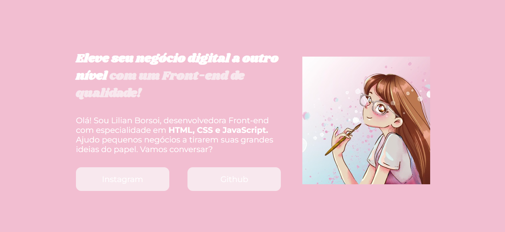

## Portfólio Lilian Borsoi - Desenvolvedora Front-end

Este repositório contém o código fonte do meu portfólio online, construído com **HTML** e **CSS**.

### Objetivo
O objetivo deste projeto é apresentar minhas habilidades como desenvolvedora front-end, exibindo meus trabalhos e projetos realizados. O site é **responsivo** e **intuitivo**, com foco na navegação fácil e na apresentação clara de meu perfil profissional.

### Funcionalidades
* **Apresentação:** Uma seção que destaca minha especialidade em HTML, CSS e JavaScript, apresentando meu objetivo profissional e oferecendo links para minhas redes sociais.
* **Design Responsivo:** O layout se adapta a diferentes tamanhos de tela, garantindo uma experiência de navegação consistente em desktops, tablets e dispositivos móveis.
* **Estilo Visual:** A estética do site é clean e moderna, utilizando uma paleta de cores suave e harmoniosa, combinada com tipografia legível.

### Tecnologias Utilizadas
* HTML
* CSS
* Google Fonts

### Como Visualizar o Projeto
1. **Clone este repositório:**
   ```bash
   git clone [https://es.wiktionary.org/wiki/removido](https://es.wiktionary.org/wiki/removido)

**Site**

* **Foto do site:**
   
